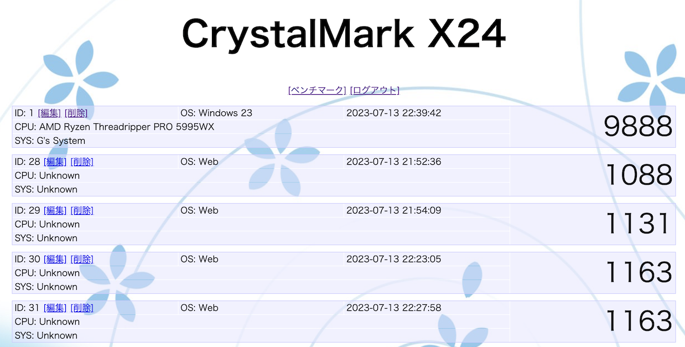

# 課題10 RDB

 

## ①課題内容（どんな作品か）
- CrystalMark X24 MVC/Class版

## ②工夫した点・こだわった点
- 講義で習ったMVCとなるようファイルの分割・整理を行いました。
- ベンチマーク結果をまとめるClassを作成しました。

## ③難しかった点・次回トライしたいこと(又は機能)
- テーブル構成の見直しを行い大量のデータを管理できるようにします。
- ベンチマークスコアでソートする機能や分析する機能を作ります。

## ④質問・疑問・感想、シェアしたいこと等なんでも
参考サイト
- 講義資料
